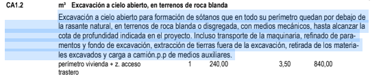
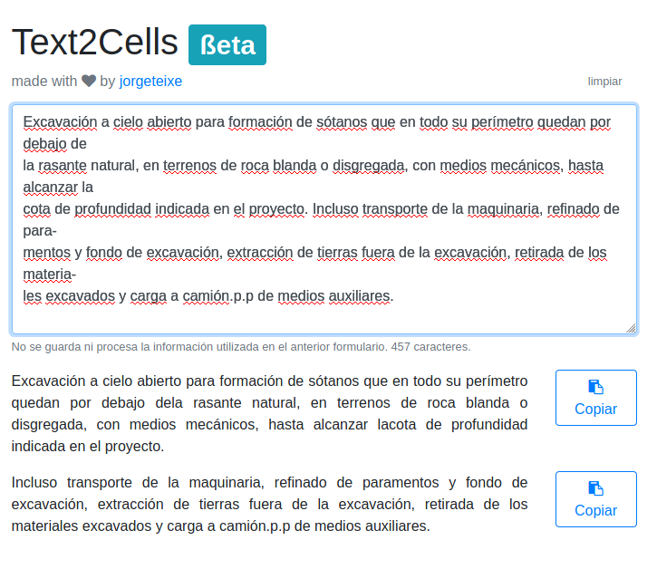

# Text To Cells

Simple app to solve a daily routine problem. Check the [demo.](https://text2cells.jorgeteixeira.es)

### Problem
A friend has to copy from PDFs to a software to create bills, and the software he uses has cells with max lenght of 256. He also has the problem that while copying from the PDF the format caused problems, so I created this to help him.

### Solution
An app that converts the text copied from PDFs with '\t' and '\n' characters 256 lenght cells without format.

### Example
**From:**

**To:**

